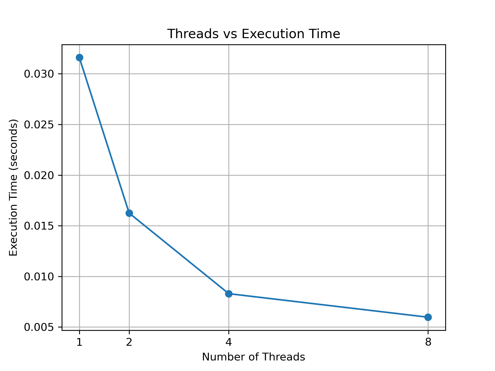
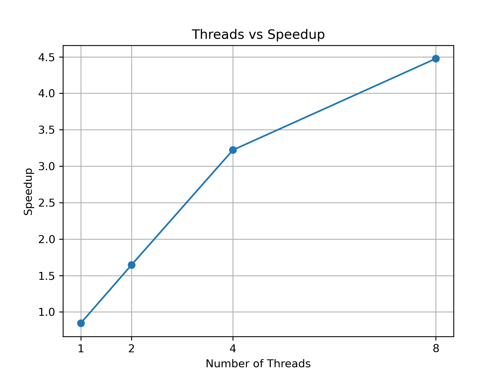
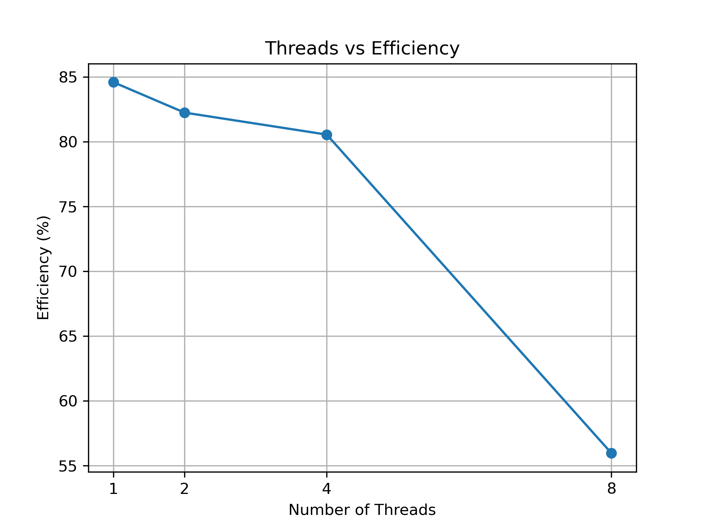

# Lab Report: Parallel Maximum/Minimum Search using OpenMP

## 1. Aim

To implement a program for finding the maximum and minimum values in a large dataset using both sequential and parallel approaches, and to compare their performance using OpenMP with different numbers of threads.

## 2. Objectives

- Find the maximum and minimum values in a large dataset.
- Implement a sequential C program.
- Implement a parallel C program using OpenMP.
- Execute the parallel program using different numbers of threads.
- Compare sequential and parallel execution times.
- Calculate speedup and efficiency.
- Generate graphs to analyze the performance.
- Study the effect of increasing the number of threads on execution time and efficiency.

## 3. Problem Statement

Finding the maximum and minimum values in a large dataset using a sequential approach requires processing the elements one by one. This can take more time as the size of the dataset increases.

The objective of this experiment is to parallelize the maximum and minimum search using OpenMP and multiple threads, and to compare the performance of the parallel implementation with the sequential implementation.

## 4. Introduction

Parallel computing is a technique in which a problem is divided into smaller tasks that can be executed simultaneously using multiple processing units.

OpenMP is an API that supports shared-memory parallel programming in C, C++, and Fortran. It provides compiler directives that allow a program to create and manage multiple threads.

In this experiment, OpenMP is used to parallelize the search for the maximum and minimum values in a dataset containing 10,000,000 integers. The performance of the parallel implementation is compared with the sequential implementation using execution time, speedup, and efficiency.

## 5. Theory

### Sequential Maximum/Minimum Search

In the sequential approach, the program examines each element of the dataset one by one.

The maximum value is updated whenever an element larger than the current maximum is found. Similarly, the minimum value is updated whenever an element smaller than the current minimum is found.

The time complexity of the sequential approach is:

**O(n)**

where `n` is the number of elements in the dataset.

### Parallel Maximum/Minimum Search

In the parallel approach, the dataset is divided among multiple threads using OpenMP.

Each thread processes its assigned portion of the dataset and calculates its own local maximum and local minimum. The local results are then combined to obtain the global maximum and minimum.

The parallel approach can reduce execution time because multiple threads can process different portions of the dataset simultaneously.

## 6. Dataset

A dataset containing **10,000,000 integer values** was generated inside the C programs.

The random number generator was initialized using:

```c
srand(42);
```

## 7. Sequential Implementation

The sequential program is implemented in `src/sequential.c`.

The program performs the following steps:

1. Allocates memory for 10,000,000 integers.
2. Generates the dataset.
3. Searches for the maximum and minimum values sequentially.
4. Measures the execution time.
5. Displays the maximum, minimum, and execution time.
6. Frees the allocated memory.

## 8. Parallel OpenMP Implementation

The parallel program is implemented in `src/parallel.c`.

OpenMP is used to divide the dataset among multiple threads.

The program uses `#pragma omp parallel` to create multiple threads and `#pragma omp for` to divide the dataset among the threads.

Each thread calculates a local maximum and local minimum for its assigned portion of the dataset.

The local results are combined using `#pragma omp critical` to safely produce the final global maximum and minimum values.

## 9. Compilation

The sequential program was compiled using Clang:

clang src/sequential.c -o sequential

The OpenMP program was compiled using Clang with the OpenMP library:

clang -Xpreprocessor -fopenmp -I$(brew --prefix libomp)/include src/parallel.c -L$(brew --prefix libomp)/lib -lomp -o parallel

## 10. Experimental Methodology

The sequential program was first executed to obtain the baseline execution time.

The OpenMP program was then executed using 1, 2, 4, and 8 threads.

The execution time was recorded for each configuration.

The following formulas were used:

Speedup = Sequential Execution Time / Parallel Execution Time

Efficiency = (Speedup / Number of Threads) × 100

## 11. Correctness Results

Both the sequential and parallel programs produced the same maximum and minimum values.

Maximum = 999999

Minimum = 0

This confirms that the parallel implementation produces the correct result.

## 12. Performance Results

The sequential program took 0.026735 seconds.

The OpenMP program was tested with 1, 2, 4, and 8 threads.

| Threads | Execution Time (s) | Speedup | Efficiency (%) |
|--------:|-------------------:|--------:|---------------:|
| 1 | 0.031602 | 0.846 | 84.60 |
| 2 | 0.016249 | 1.645 | 82.25 |
| 4 | 0.008296 | 3.222 | 80.55 |
| 8 | 0.005973 | 4.476 | 55.95 |

The best execution time was obtained using 8 threads, with an execution time of 0.005973 seconds.

## 13. Performance Graphs

### 13.1 Threads vs Execution Time



### 13.2 Threads vs Speedup



### 13.3 Threads vs Efficiency



## 14. Result Analysis

The experimental results show that increasing the number of OpenMP threads generally reduces the execution time.

With 2 threads, the execution time decreased from the sequential baseline of 0.026735 seconds to 0.016249 seconds.

With 4 threads, the execution time further decreased to 0.008296 seconds, giving a speedup of 3.222.

With 8 threads, the lowest execution time of 0.005973 seconds was obtained, giving a speedup of 4.476.

The 1-thread OpenMP execution was slightly slower than the sequential program because of the overhead introduced by OpenMP.

The efficiency decreased at higher thread counts because thread management and synchronization overhead become more significant.

Overall, OpenMP provided a significant performance improvement for the maximum/minimum search.

## 15. Comparison

The sequential implementation processes the entire dataset using a single execution flow.

The OpenMP implementation divides the dataset among multiple threads, allowing several portions to be processed simultaneously.

The sequential execution time was 0.026735 seconds.

The best OpenMP execution time was 0.005973 seconds using 8 threads.

This represents a speedup of approximately 4.476 times compared with the sequential implementation.

Therefore, the OpenMP parallel implementation provides better performance for this large dataset.

## 16. Conclusion

The maximum and minimum values of a large dataset were successfully found using both sequential and OpenMP parallel approaches.

The OpenMP implementation successfully divided the workload among multiple threads and produced the same results as the sequential implementation.

The experimental results showed that increasing the number of threads reduced execution time up to the tested 8-thread configuration.

The best performance was achieved with 8 threads, with an execution time of 0.005973 seconds and a speedup of 4.476.

This experiment demonstrates how OpenMP can improve the performance of computationally intensive tasks by using parallel execution.

## 17. Project Files

The project contains the following important files:

- `src/sequential.c` — Sequential maximum/minimum search implementation.
- `src/parallel.c` — OpenMP parallel maximum/minimum search implementation.
- `results/results.csv` — Experimental performance results.
- `graphs/execution_time.png` — Threads versus execution time graph.
- `graphs/speedup.png` — Threads versus speedup graph.
- `graphs/efficiency.png` — Threads versus efficiency graph.
- `graphs/create_graphs.py` — Python script used to generate the graphs.
- `LAB_REPORT.md` — Complete laboratory report.
- `.gitignore` — Specifies files excluded from Git tracking.

## 18. GitHub Repository

The complete project, source code, experimental results, graphs, and laboratory report are maintained in the GitHub repository.

Repository: https://github.com/Tanmayee-kalal/Lab1

## 19. Final Outcome

The project successfully demonstrates parallel maximum and minimum search using OpenMP.

The sequential and parallel implementations produced identical results.

The experimental evaluation showed that OpenMP can significantly reduce execution time when multiple threads are used.

The project includes the source code, performance measurements, calculated speedup and efficiency, graphs, and complete laboratory documentation.